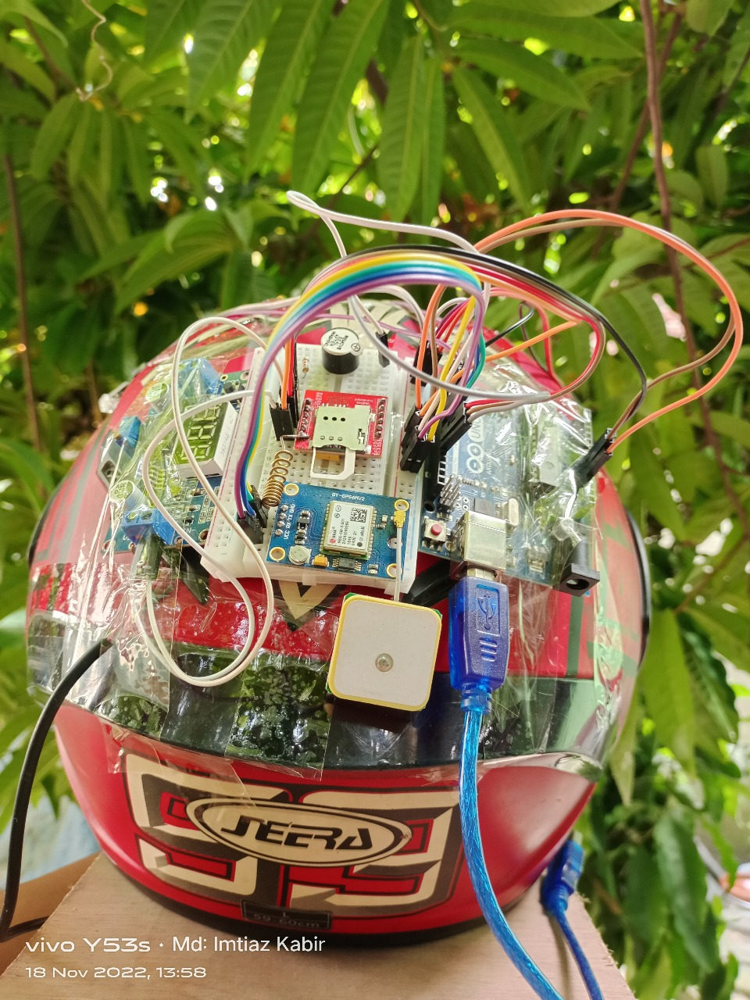
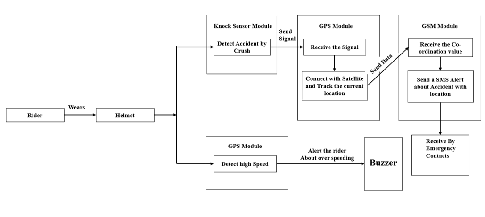
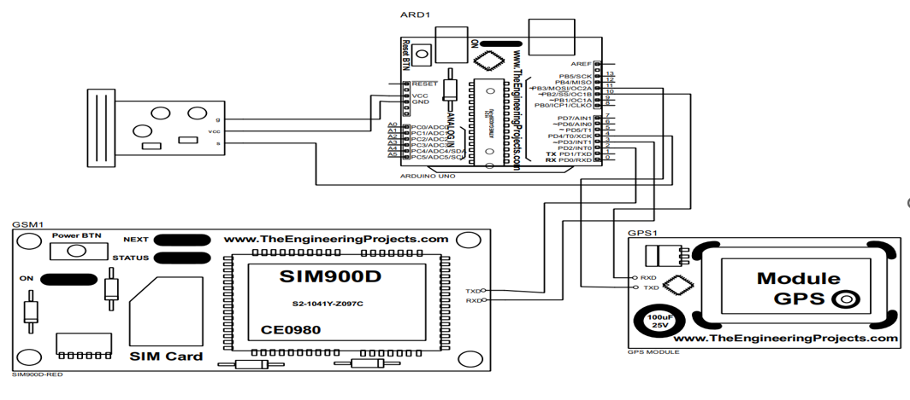

# SmartHat — Arduino-Based Smart Helmet for Rider Safety

[](https://www.arduino.cc/)
[](#hardware-components)
[](#project-status)
[](LICENSE)

SmartHat is an **Arduino-based smart helmet prototype** designed to improve motorcycle rider safety by detecting potentially serious impacts, obtaining the rider's GPS position, and sending an emergency SMS through a GSM module.

> **Academic prototype:** SmartHat is a student project and should not be treated as a certified safety device or a replacement for a standards-compliant motorcycle helmet.



## Table of contents

- [Overview](#overview)
- [Features](#features)
- [How it works](#how-it-works)
- [Hardware components](#hardware-components)
- [System architecture](#system-architecture)
- [Repository structure](#repository-structure)
- [Setup](#setup)
- [Testing and results](#testing-and-results)
- [Limitations](#limitations)
- [Roadmap](#roadmap)
- [Contributing](#contributing)
- [License](#license)
- [Credits](#credits)

## Overview

The project combines impact/vibration sensing, GPS positioning, GSM communication, and audio feedback into one helmet-mounted prototype. The intended emergency flow is:

```text
Impact detected
      ↓
Confirm crash event
      ↓
Acquire GPS position
      ↓
Send emergency SMS
      ↓
Provide local audio feedback
```

## Features

- **Impact detection** — uses a KY-031 knock sensor and 801S vibration sensor as the prototype's crash-sensing inputs.
- **GPS positioning** — uses a NEO-M8N module to obtain latitude/longitude data.
- **Emergency SMS** — uses a SIM800L GSM module to notify an emergency contact.
- **Speed monitoring** — intended to warn the rider when speed exceeds a configured threshold.
- **Audio feedback** — a mini speaker provides local alerts.
- **Experimental Bluetooth extension** — an HC-06 module is listed as a future enhancement for rider-to-rider communication.

## How it works

1. Sensors continuously monitor the helmet for impact/vibration events.
2. When a possible accident is detected, the controller starts the emergency sequence.
3. The GPS module is used to obtain the latest available position.
4. The GSM module sends an SMS containing the emergency notification and location.
5. The speaker can provide local status or warning feedback.

The system architecture and wiring diagrams are available in [`doc/diagrams/`](doc/diagrams/).

## Hardware components

| Component | Purpose |
|---|---|
| Arduino UNO R3 | Main microcontroller |
| NEO-M8N GPS | Position tracking |
| SIM800L GSM | Emergency SMS communication |
| KY-031 knock sensor | Impact detection |
| 801S vibration sensor | Vibration/impact input |
| LM2596 buck converter | Adjustable power regulation |
| 35 mm mini speaker | Audio alerts |
| HC-06 Bluetooth module | Planned future communication feature |

### Power note

The SIM800L is a cellular module with a demanding power supply and should **not be assumed to be safe to power directly from a 5 V Arduino rail**. Use an appropriate regulated supply and adequate current capacity for the actual module. Verify the voltage/current requirements of every module before assembling the prototype.

## System architecture



## Circuit diagram



## Repository structure

```text
SmartHat/
├── README.md
├── LICENSE
├── CONTRIBUTING.md
├── CODE_OF_CONDUCT.md
├── SECURITY.md
├── .gitignore
├── data/
│   ├── Frequency.PNG
│   ├── GPS.PNG
│   ├── GPSGSM.PNG
│   ├── GPSGSMKnock.PNG
│   ├── GSM.PNG
│   ├── Knock.PNG
│   └── KnockVibration.PNG
└── doc/
    └── diagrams/
        ├── CircuitDiagram.PNG
        ├── Helmet.jpeg
        └── SystemArchitectureDiagram.PNG
```

> **Important:** The current public repository does not contain the firmware source referenced by the original README. The documentation has therefore been corrected so it does not claim that a firmware file is currently available. Add the actual `.ino` source when it is ready to be published.

## Setup

### 1. Clone the repository

```bash
git clone https://github.com/anikmd/SmartHat.git
cd SmartHat
```

### 2. Review the hardware documentation

Before powering the prototype, review:

- [`doc/diagrams/CircuitDiagram.PNG`](doc/diagrams/CircuitDiagram.PNG)
- [`doc/diagrams/SystemArchitectureDiagram.PNG`](doc/diagrams/SystemArchitectureDiagram.PNG)

Confirm module voltage requirements, common ground, serial connections, and the GSM power supply before testing.

### 3. Firmware

The firmware is **not currently included in this public repository**. Do not upload an assumed or reconstructed firmware file as if it were the original project implementation.

When the original firmware is added, document:

- Arduino IDE version
- Board and processor selection
- Required libraries
- Pin assignments
- GSM APN/SIM requirements
- Emergency contact configuration
- Speed threshold configuration
- GPS acquisition behavior

### 4. Hardware testing

Power the prototype only after checking the circuit and module-specific voltage requirements. Test each subsystem independently before performing an integrated emergency-alert test.

## Testing and results

The original project recorded the following prototype test observations:

| Module | Reported result |
|---|---:|
| GPS | 100% outdoors |
| GSM | 83–100% |
| Knock sensor | 75–100% |

These values are retained as **project observations**, not as statistically validated safety performance metrics. A future test plan should record sample count, test conditions, false positives, false negatives, GPS fix time, SMS delivery time, and environmental conditions.

The existing experimental images are stored in [`data/`](data/).

## Limitations

- The public repository currently lacks the firmware source code required to reproduce the complete software behavior.
- Impact and vibration sensors can produce false positives or miss real crash events; they are not equivalent to a certified crash-detection system.
- GPS performance depends on satellite visibility and environment.
- GSM/SMS delivery depends on network coverage, SIM configuration, and carrier availability.
- Speed monitoring requires reliable GPS data and a clearly defined threshold/calculation method.
- The prototype has not been presented here as safety-certified or production-ready hardware.

## Roadmap

- [ ] Publish the original Arduino firmware and pin mapping.
- [ ] Add a reproducible bill of materials with module specifications.
- [ ] Document emergency-contact and GSM configuration safely without exposing private credentials.
- [ ] Add structured crash-detection logic and debounce/confirmation behavior.
- [ ] Measure GPS fix time and SMS delivery latency across repeated tests.
- [ ] Add automated or repeatable sensor test procedures.
- [ ] Improve power management and battery monitoring.
- [ ] Investigate helmet-wear detection before ignition integration.
- [ ] Explore rider-condition monitoring after a detected crash.
- [ ] Evaluate AI-assisted crash classification as a research extension.
- [ ] Evaluate Bluetooth communication as a separate feature.

## Contributing

Contributions, documentation improvements, test results, and hardware feedback are welcome. See [`CONTRIBUTING.md`](CONTRIBUTING.md) for the development and pull-request guidelines.

## License

This project is licensed under the MIT License. See [`LICENSE`](LICENSE) for the full text.

## Credits

Developed by **Md. Anik** and **Nishat Tasnim Ali** as a Computer Science and Engineering project at **City University, Bangladesh**.

For questions or suggestions, please open a GitHub issue in this repository.

---

**Stay safe. Ride smart.**
